<h1 style="text-align:center; font-size:45px; font-family:cursive;">CryptoFy</h1>

<h1 style="text-align:center; font-weight:bolder;">Documentation</h1>

# ~ Landing Page

### **Header Section**
   - **Logo and Navigation Menu**
   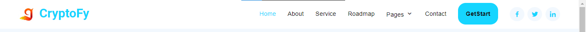

   - **Get Started Button (linked to Registration Form)**
        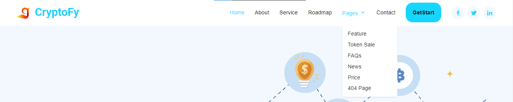

### **Main Banner**
- **Catchy headline**
- **Eye-catching visuals**
 
- 

   

### **Features Section**
   - **News Page** : Latest updates and announcements

   - **Dynamic Price Page** : Real-time cryptocurrency prices

   
   - **Contact Us Page** :Working Form for user inquiries

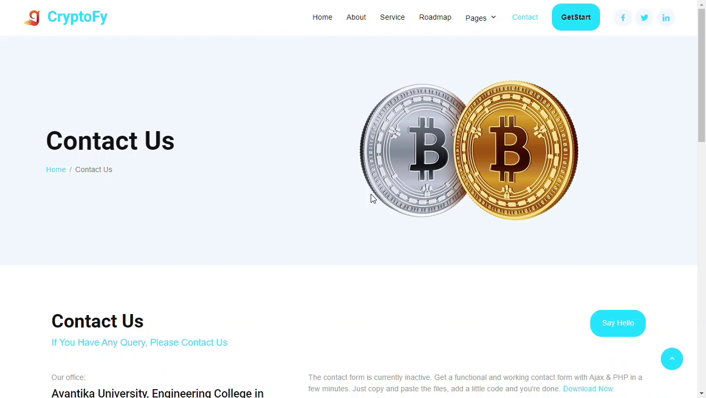

### **Footer Section**
   - **Social media links**
   - **Newsletter**
   - **Copyright information**

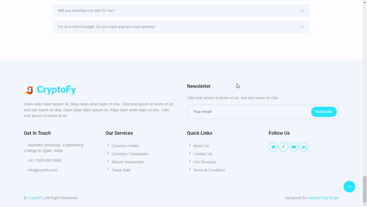
### **Get Started Section**
   - **Registration Form with Terms and Conditions**

        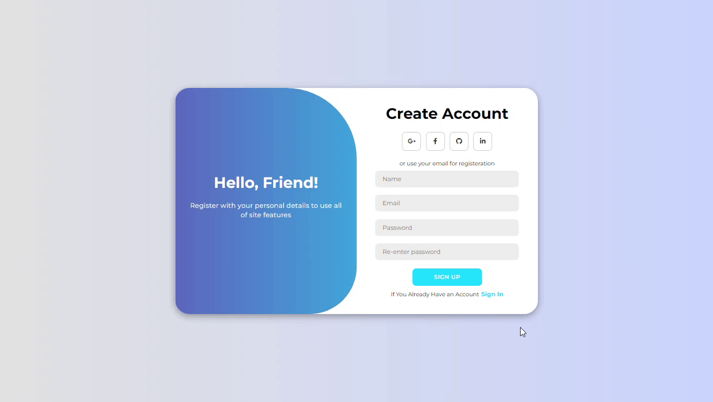
### **404 Page**

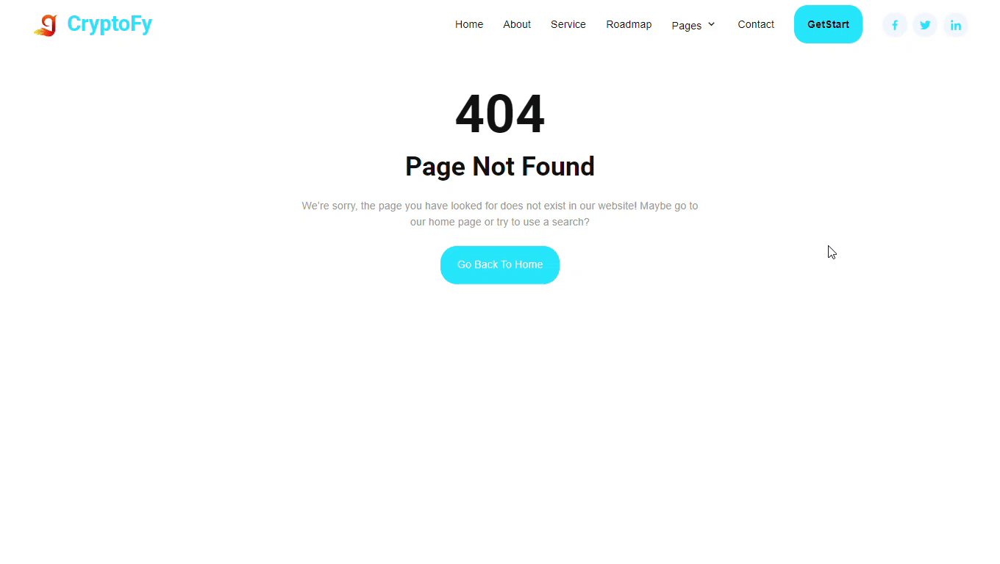
# ~  Admin Dashboard

### **Admin Overview**
- **Loader** 

   
- **Light and Dark Mode feature toggle**

   
- **General overview**

   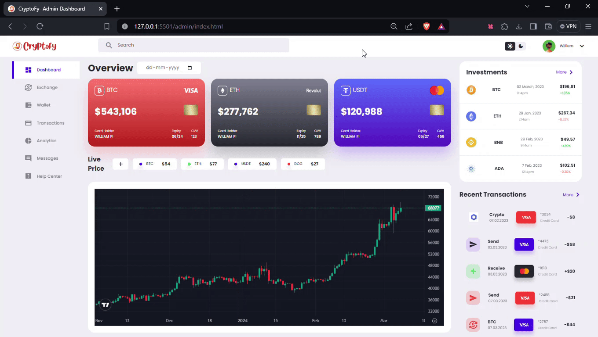

   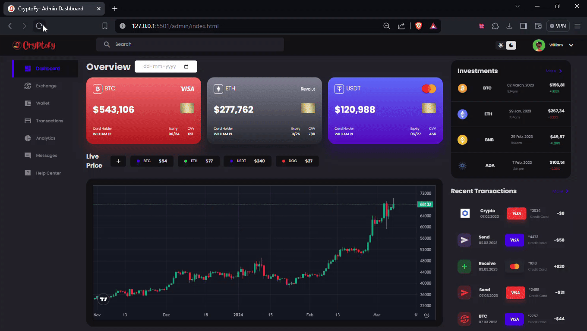
### **Exchange Page**
   - **Platform for trading cryptocurrencies**
   - **Market charts and order book**

### **Message Page**
   - **Inbox for user messages and notifications**

    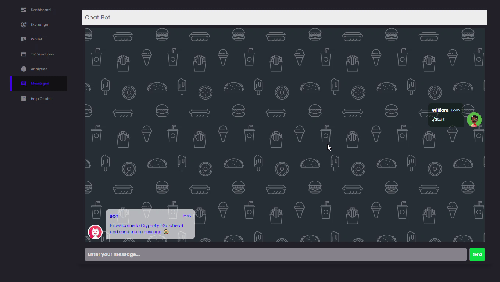

### **Help Desk Page**
   - **Support ticket system for user queries**

    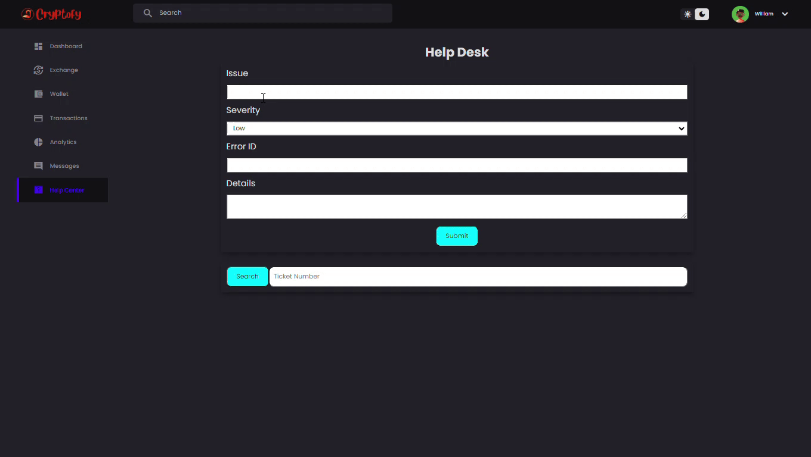
### **Wallet**
   - **Management of user cryptocurrency wallets**

    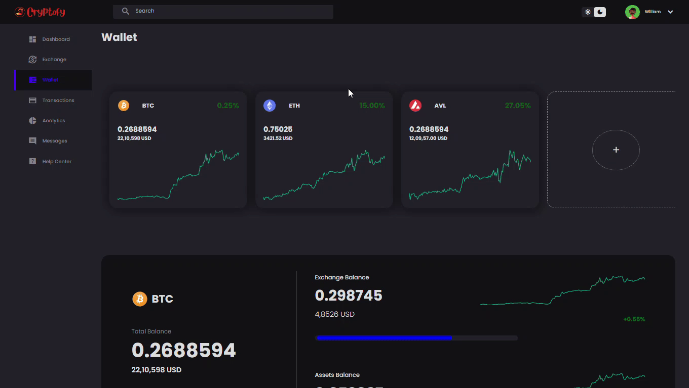
### **Transactions**
   - **History of user transactions**

    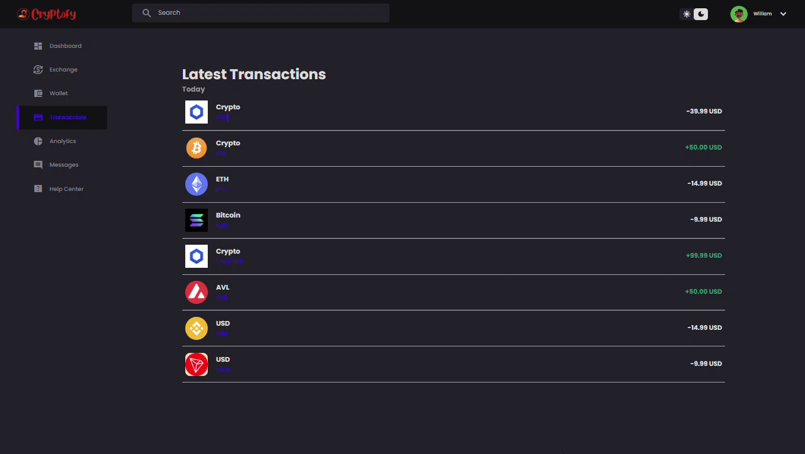

### **Analytics**
   - **Statistical data and insights**

    
# ~Landing Page Enhancements
- **Interactive Smile Animation**: A smiling face with hover effect to engage users.

   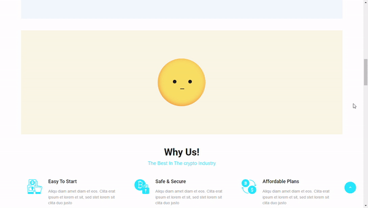

- **Counting Fact Page**: Display interesting facts about cryptocurrency trading with a counter animation.

   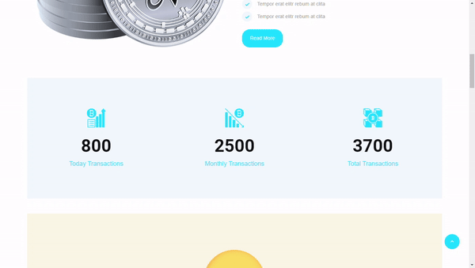
- **Countdown Logic**: Display a countdown timer for upcoming Offer.

   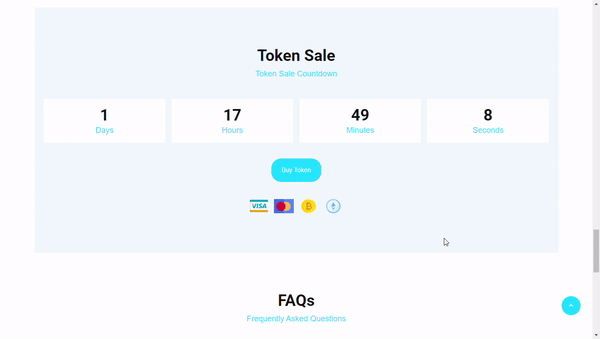
# ~Conclusion
### ***Creating a cryptocurrency exchange website with these features requires meticulous planning, design, and development. Main point is This website is user-friendly,User Intractive and responsive across all devices.***

<h1 style="text-align:center; font-size:150px; font-family:cursive;">Thankyou<h1>